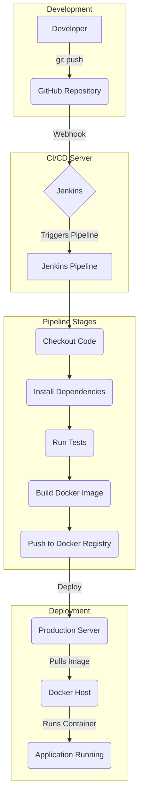

# Online Grocery Store

This is a full-stack online grocery store application with a React frontend and a Node.js/Express backend.

## CI/CD System Design with Jenkins and Docker

This document outlines the architecture and workflow of the Continuous Integration and Continuous Deployment (CI/CD) pipeline for the Online Grocery Store application, using Jenkins and Docker.

### Architecture

The CI/CD pipeline is designed to automate the build, test, and deployment process.

### Workflow

1.  **Code Commit:** A developer pushes code changes to the project's GitHub repository.
2.  **Jenkins Trigger:** A webhook configured in GitHub notifies the Jenkins server of the new push, which automatically triggers the CI/CD pipeline defined in the `Jenkinsfile`.
3.  **Checkout & Dependencies:** Jenkins checks out the latest code from the repository and installs the necessary dependencies for both the frontend and backend.
4.  **Testing:** Automated tests are run for both the frontend and backend to ensure code quality and prevent regressions.
5.  **Docker Build:** If the tests pass, Jenkins builds a Docker image of the Node.js server using the `Dockerfile` located in the `Server/` directory. This image encapsulates the application and its environment.
6.  **Push to Registry:** The newly created Docker image is tagged and pushed to a Docker registry (like Docker Hub or a private registry).
7.  **Deployment:** Jenkins connects to the production server (via SSH) and issues a command to pull the latest Docker image from the registry and run it as a new container, effectively updating the application.
